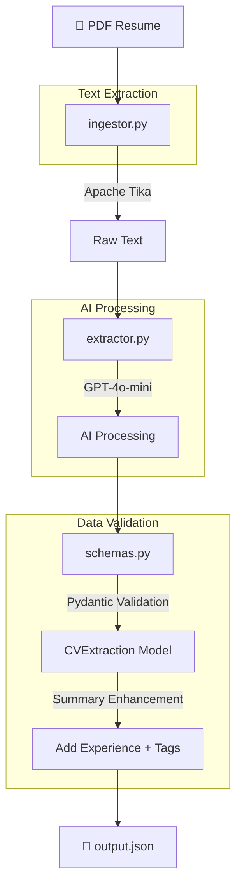

#  CV Extraction

An AI-powered CV/Resume parser that extracts structured data from PDF resumes using GPT-4o-mini and outputs clean JSON.

##  Features

- **PDF Text Extraction**: Uses Apache Tika to extract text from PDF resumes
- **AI-Powered Parsing**: Leverages GPT-4o-mini via Pydantic-AI for intelligent data extraction
- **Structured Output**: Returns validated JSON with contact info, skills, work history, and more
- **High Potential Detection**: Automatically flags candidates with GitHub/Portfolio links
- **Experience Calculation**: Automatically calculates total years of experience

## Flowchart



##  Project Structure

```
cv_extraction/
├── src/
│   ├── ingestor.py      # PDF text extraction using Tika
│   ├── schemas.py       # Pydantic models for CV data
│   └── extractor.py     # Main extraction logic with AI agent
├── data/
│   └── *.pdf            # Input PDF resumes
├── output.json          # Extracted structured data
├── requirements.txt     # Python dependencies
└── README.md
```

##  Installation

### Prerequisites
- Python 3.9+ (recommended: Python 3.12)
- Java Runtime (required for Apache Tika)

### Setup

1. Clone the repository and navigate to the project:
   ```bash
   cd cv_extraction
   ```

2. Create and activate a virtual environment:
   ```bash
   python3.12 -m venv venv
   source venv/bin/activate  # On Windows: venv\Scripts\activate
   ```

3. Install dependencies:
   ```bash
   pip install -r requirements.txt
   ```

4. Create a `.env` file with your OpenAI API key:
   ```env
   OPENAI_API_KEY=your_api_key_here
   ```

## 💻 Usage

1. Place your PDF resume in the `data/` folder

2. Update the filename in `src/extractor.py` if needed:
   ```python
   pdf_file = Path(__file__).parent.parent / "data" / "your_resume.pdf"
   ```

3. Run the extractor:
   ```bash
   python3.12 src/extractor.py
   ```

4. Find the structured output in `output.json`

## 📋 Output Schema

The extracted data follows this structure:

| Field | Type | Description |
|-------|------|-------------|
| `full_name` | string | Candidate's full name |
| `email` | string | Primary email address |
| `phone_number` | string | Contact phone number |
| `location` | string | City/Region |
| `technical_skills` | array | List of technical skills |
| `soft_skills` | array | List of soft skills |
| `work_experience` | array | Paid jobs with company, role, years, months |
| `volunteering` | array | Unpaid/volunteer experiences |
| `links` | array | Online presence (LinkedIn, GitHub, Portfolio) |
| `summary` | string | AI-enhanced summary with experience calculation |

### Example Output

```json
{
  "full_name": "John Doe",
  "email": "john@example.com",
  "phone_number": "+1234567890",
  "location": "New York, NY",
  "technical_skills": ["Python", "SQL", "Machine Learning"],
  "soft_skills": ["Leadership", "Communication"],
  "work_experience": [
    {
      "company": "Tech Corp",
      "role": "Data Analyst",
      "years": 2,
      "months": 6
    }
  ],
  "volunteering": [
    {
      "organization": "Code for Good",
      "role": "Mentor"
    }
  ],
  "links": [
    {
      "platform": "GitHub",
      "url": "https://github.com/johndoe"
    }
  ],
  "summary": "[HIGH POTENTIAL] 3 years experience Software Engineer skilled in..."
}
```

##  How It Works

1. **PDF Ingestion** (`ingestor.py`): Apache Tika extracts raw text from the PDF resume

2. **AI Extraction** (`extractor.py`): 
   - A Pydantic-AI agent with GPT-4o-mini acts as a "Senior Technical Recruiter"
   - Analyzes the text and extracts structured information
   - Distinguishes between paid work and volunteering

3. **Data Validation** (`schemas.py`):
   - Pydantic models validate all extracted data
   - Automatically calculates total experience
   - Adds `[HIGH POTENTIAL]` tag for candidates with GitHub/Portfolio links

##  Dependencies

- `openai` - OpenAI API client
- `pydantic` - Data validation
- `pydantic-ai` - AI agent framework
- `tika` - PDF text extraction
- `python-dotenv` - Environment variable management
- `nest-asyncio` - Async compatibility

## 📝 License

MIT License
